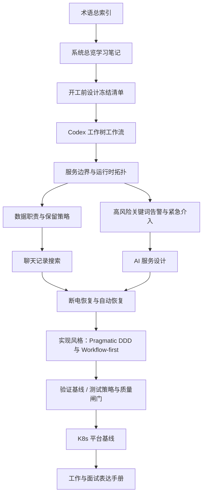

# 如何学习这个项目

## 适合谁
- 适合把自己当成零基础但想快速进入生产实战的后端开发。
- 目标不是背概念，而是能看懂、能实现、能上线、能讲出来。

## 推荐学习顺序
1. 先学 [[术语总索引]]，遇到不会的词就点进去。
2. 再学 [[系统总览学习笔记]]，建立大图。
3. 接着看 [[开工前设计冻结清单]]，理解“什么时候算真正能开工”。
4. 再看 [[Codex 工作树工作流]]，理解这个仓库里 AI 代理和你怎么安全协作。
5. 然后看 [[服务边界与运行时拓扑]]、[[数据职责与保留策略]] 和 [[高风险关键词告警与紧急介入]]，理解系统怎么拆、数据放哪、风险升级怎么做。
6. 再看 [[聊天记录搜索]]、[[AI 服务设计]] 和 [[断电恢复与自动恢复]]，理解这个项目最关键的三个难点。
7. 再看 [[实现风格：Pragmatic DDD 与 Workflow-first]]、[[验证基线]] 和 [[测试策略与质量闸门]]，理解代码层面应该怎么落、怎么证明改动真的安全。
8. 最后看 [[K8s 平台基线]] 和 [[工作与面试表达手册]]，把设计能力转成工作和面试表达。

## 学习路线图

- 怎么看这张图：先按从上到下的主线读，不要一开始钻实现细节；每进入一个专题前，先确认自己已经懂前一层的边界和职责。

## 主流学习方法
### 1. 费曼学习法
- 学完一篇笔记后，用自己的话复述“这是什么、为什么这样做、替代方案是什么”。
- 如果讲不清，说明还没真正懂。

### 2. 项目驱动学习
- 不要只背概念，要始终回到“这个概念在本项目里负责什么”。
- 比如学 [[OpenSearch]]，重点不是背所有功能，而是知道它为什么只做聊天搜索读侧。

### 3. 对比学习
- 把两个方案放在一起比。
- 例如：
  - [[PostgreSQL]] vs [[OpenSearch]]
  - [[微服务]] vs 模块化单体
  - [[RAG]] vs 纯大模型回答

### 4. 刻意练习
- 每看完一篇，至少做一件事：
  - 画图
  - 讲给别人听
  - 写成伪代码
  - 写成面试回答

### 5. 复盘
- 每周回答 3 个问题：
  - 我这周真正理解了什么
  - 我还能讲清哪些概念
  - 哪些地方离生产落地还差一层

## 每篇笔记怎么读
- 先看“你先记住”
- 再看“这是什么”
- 再看“为什么要这样设计”
- 然后看“本项目怎么用”
- 最后一定要看“工作里怎么用”和“面试怎么说”

## 学会的标准
- 你能解释它，不只是能看懂它。
- 你能知道它在生产里为什么这样选，而不是别的方案。
- 你能用 1 分钟和 5 分钟两个版本讲出来。

## 学习提醒
- 遇到陌生词，优先点双链。
- 不要跳过基础概念。
- 不要一上来就记细节配置，先记边界和职责。

## 你下一步应该看什么
1. [[权威设计包索引]]
2. [[09-Testing/README|09-Testing]]
3. [[07-Platform/README|07-Platform]]
