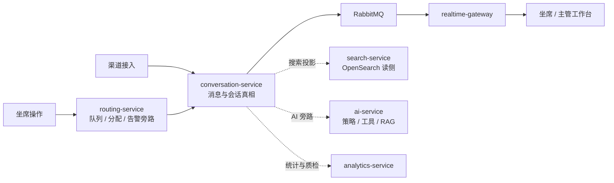

# 系统总览学习笔记

对应正式文档：`docs/architecture/system-overview.md`

## 这是什么
这是一个基于 [[.NET 10 LTS]]、[[ASP.NET Core]]、[[微服务]]、[[多租户]] 的生产级客服系统。

## 你先记住
- [[PostgreSQL]] 是业务真相。
- [[OpenSearch]] 只是聊天记录搜索读侧。
- [[RabbitMQ]] 负责异步事件。
- [[SignalR]] 负责实时推送。
- AI 不能越权决定设备和订单事实。

## 为什么要这样设计
- 客服系统最怕三类事故：
  - 串租户
  - 聊天卡顿
  - AI 越权
- 所以必须把真相、搜索、实时、AI 分开管理。

## 在本项目里怎么用
- 聊天热路径由 [[channel-service]]、[[conversation-service]] 和 [[Realtime Gateway]] 串起来：渠道接入 -> 消息落库 -> 事件发布 -> 实时推送
- [[ai-service]] 是旁路增强，不阻塞真相写入
- [[search-service]] 是旁路投影，不回写业务真相
- 管理告警旁路由 [[routing-service]] 承接，包括 [[高风险关键词告警与紧急介入]] 和 [[响应时限告警]]

## 主链路与旁路图

- 怎么看这张图：中间那条实线是聊天主链路，必须优先保证稳定和可恢复；虚线是旁路能力，它们可以增强体验，但不能反过来阻塞真相写入。

## 工作里怎么用
- 和产品讨论时，用这篇先对齐全局。
- 写代码前先问：
  - 这是热路径还是旁路
  - 这是业务真相还是派生数据
  - 会不会破坏 [[租户隔离]]

## 面试怎么说
- “我会把事务真源、搜索读侧、AI 决策和实时推送拆开，避免一个组件同时承担真相、检索和智能决策，导致边界失控。”

## 继续学习
- 下一篇看 [[服务边界与运行时拓扑]]
- 然后看 [[数据职责与保留策略]]
- 再看 [[验证基线]]
