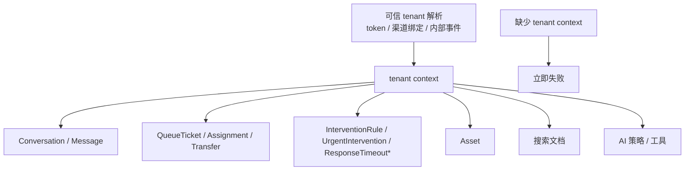

# 多租户与客服域模型

对应正式文档：`docs/domain/multi-tenant-and-domain-model.md`

## 这是什么
- 这篇讲两个最核心的业务问题：
  - 什么是 [[多租户]]
  - 客服域里最重要的业务对象有哪些

## 多租户底线
- 没有默认租户
- tenant 只能来自可信解析
- 搜索、AI、缓存、[[对象存储]] 都不能绕过 [[租户隔离]]

## 客服域核心对象
- [[Conversation]]
- [[Message]]
- [[QueueTicket]]
- [[Assignment]]
- [[Transfer]]
- [[Asset]]
- [[InterventionRule]]
- [[UrgentIntervention]]
- [[ResponseTimeoutPolicy]]
- [[ResponseTimeoutAlert]]

## tenant 上下文与核心对象图

- 怎么看这张图：先把 `tenant` 解析成可信上下文，再把它带进业务对象、搜索读侧和 AI 旁路；如果上下文缺失，系统必须失败关闭，不能偷偷猜默认租户。

## 为什么重要
- 你做的是“真实多企业租户”系统，不是单租户后台。
- 所以很多在普通业务里能偷懒的地方，在这里都不能偷懒。

## 在本项目里怎么用
- 客户进来先解析租户。
- 会话、消息、队列、搜索文档、AI 策略都带 `tenant_id`。
- 管理员和平台管理员要严格区分。
- [[InterventionRule]]、[[ResponseTimeoutPolicy]] 和 [[NotificationEndpoint]] 也必须严格租户隔离。

## 工作里怎么用
- 每次看一个需求时，第一反应不是“怎么写代码”，而是“tenant 从哪来、能不能伪造、有没有串租户风险”。

## 面试怎么说
- “我在多租户系统里会把 tenant 当成一等上下文，而不是普通字符串参数。数据库、缓存、事件、搜索、对象存储都必须带 tenant 边界。”

## 你下一步应该看什么
1. [[01-Architecture/服务边界与运行时拓扑|服务边界与运行时拓扑]]
2. [[高风险关键词告警与紧急介入]]
3. [[09-Testing/验证基线|验证基线]]
