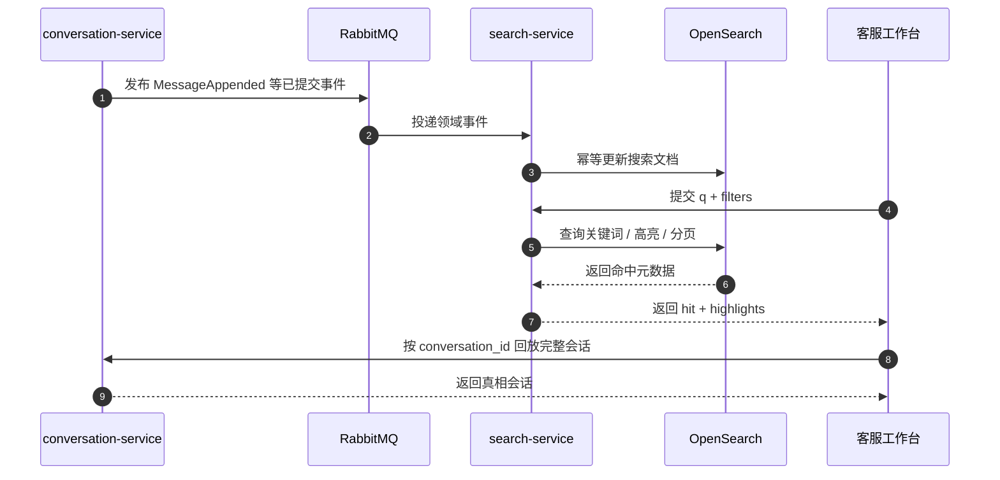

# 聊天记录搜索

对应正式文档：`docs/search/chat-history-search.md`

## 这是什么
- 这是客服工作台的消息检索系统。
- 它不是单纯的数据库查询，而是一个独立的搜索 [[读模型]]。

## 为什么单独做
- 客服工作台需要快搜索、高亮、筛选、分页、自动补全。
- 这些能力不应该压在事务 [[PostgreSQL]] 主库上，所以要单独使用 [[OpenSearch]]。

## V1 范围
- 搜文本
- 按时间、客户、客服、渠道、队列、状态筛
- 图片和视频只按是否有媒体来筛

## 你先记住
- [[OpenSearch]] 只是搜索读侧，不是真相。
- 真相还在 [[PostgreSQL]]。
- 搜索结果命中后，要回源看完整会话。

## 不能做的事
- OpenSearch 挂了就偷偷扫全库 [[PostgreSQL]]
- 把视频内容当可搜索内容

## 在本项目里怎么用
- `conversation-service` 写真相并发事件
- `search-service` 消费事件建索引
- 工作台查 [[OpenSearch]]
- 会话回放查 `conversation-service`

## 搜索读侧时序图

- 怎么看这张图：搜索只负责“快速找到哪条消息命中”，真正完整的会话真相还是要回到 `conversation-service` 获取，所以 [[OpenSearch]] 永远不是事务真源。

## 工作里怎么用
- 你以后做搜索功能时，先问：
  - 这是搜索读侧需求，还是事务查询需求？
- 如果强调关键词、高亮、复杂筛选，通常就是搜索读侧。

## 面试怎么说
- “聊天记录搜索我会做成 OpenSearch 读模型，PostgreSQL 保持事务真源。这样既能满足工作台搜索体验，又不会让主库承担搜索引擎职责。”
