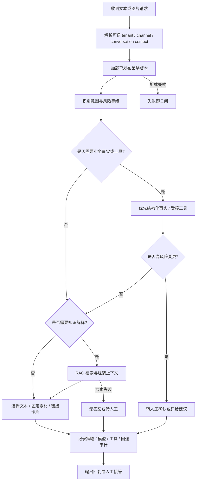

# AI 服务设计

对应正式文档：`docs/ai/ai-service-design.md`

## 这是什么
- [[ai-service]] 不是“调一下大模型接口”。
- 它是一个受 [[策略引擎]]、[[审计]]、工具边界和租户规则控制的 AI 决策层。

## AI 不是普通聊天接口
- 它要决定：
  - 能不能回
  - 回什么
  - 要不要查知识库
  - 要不要调工具
  - 要不要转人工

## 内部模块
- orchestrator
- [[RAG]]
- tool-executor
- [[策略引擎]]
- prompt-config
- evaluation
- learning-pipeline

## 为什么这样拆
- 如果 AI 逻辑散落在各个业务服务里，后面会非常难治理。
- 单独服务 + 内部模块化，既能保持边界清晰，也方便后续演进。

## 关键规则
- 模型 SDK 不进业务服务
- 所有策略走数据库版本化配置
- 高风险工具永不自动执行

## 在本项目里怎么用
- 文本和图片可以进入 AI 决策
- 视频不进 AI 热路径
- AI 可以回文字、固定图片、固定视频、链接卡片
- 常见模式是 [[Copilot]] 和 [[Autopilot]]
- 设备和订单事实优先来自业务 API，不来自模型想象

## AI 决策流程图

- 怎么看这张图：AI 先过策略和风险判断，再决定要不要查知识库、调工具或转人工；它不是先调模型再补规则，而是先定边界再决定模型能做什么。

## 工作里怎么用
- 做 AI 功能时，别先问“模型能不能”，先问：
  - 这件事允许 AI 做吗
  - 风险等级是什么
  - 出错后怎么回退
  - 有没有 [[审计]] 链路

## 面试怎么说
- “我做 AI 服务会把它设计成受策略控制的决策系统，而不是让大模型直接越过业务边界。模型、知识库、工具、审计、回退必须拆开。”

## 你下一步应该看什么
1. [[知识库与 RAG]]
2. [[06-Search/聊天记录搜索|聊天记录搜索]]
3. [[09-Testing/测试策略与质量闸门|测试策略与质量闸门]]
