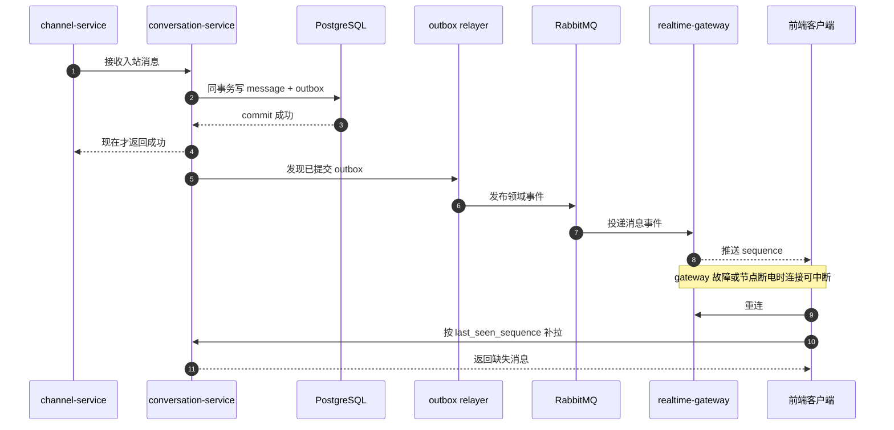

# 断电恢复与自动恢复

对应正式文档：`docs/reliability/power-loss-and-recovery.md`

## 这是什么
- 这篇讲的是：如果单个服务实例挂掉，或者单个服务器节点突然断电，系统能不能自己恢复。
- 重点不是“服务会不会重启”，而是“消息会不会丢、数据会不会乱、主流程会不会自动继续”。

## 你先记住
- [[Kubernetes]] 只能帮你把服务拉起来，不保证消息不丢。
- 真正保证不丢的是：
  - [[PostgreSQL]] 持久化
  - [[Outbox 模式]]
  - [[RabbitMQ]] 持久队列
  - 消费者 [[幂等]]
  - 前端重连后按消息序号补拉

## 恢复语义
- 已经被系统确认接收的消息不能丢。
- 实时连接可以断，但恢复后要能补消息。
- 搜索、AI、统计可以晚一点恢复。
- 不能因为重试多发一条消息或多执行一次业务动作。

这套规则就是 [[恢复语义]]。

## 在本项目里怎么做
- 入站消息先写 [[PostgreSQL]]，成功提交后才返回成功。
- 同一个事务里写 [[Outbox 模式]] 记录。
- 之后再发到 [[RabbitMQ]]。
- [[Realtime Gateway|realtime-gateway]] 挂了没关系，前端重连后按 `sequence` 补消息。
- [[OpenSearch]] 和 AI 都是旁路，恢复慢一点不影响聊天真相。

## 提交、投递与补拉时序图

- 怎么看这张图：最关键的点只有两个，第一是“提交成功后才能 ack”，第二是“实时连接断了也能按 sequence 补回来”；只要这两点成立，单点故障就不会变成消息丢失。

## 你要理解的几个关键词
- [[故障转移]]
- [[Quorum Queue]]
- [[幂等]]
- [[恢复语义]]

## 工作里怎么用
- 当别人说“我们上了 K8s，所以高可用了”，你要继续追问：
  - 消息落哪
  - 先回成功还是先落库
  - 重试会不会重复
  - 断线后怎么补数据

## 面试怎么说
- “我会把单点故障恢复拆成两层：服务自动拉起和业务自动恢复。前者靠 Kubernetes，后者靠 PostgreSQL 真源、Outbox、RabbitMQ 持久化、幂等消费和客户端 replay。”

## 你下一步应该看什么
1. [[07-Platform/K8s 平台基线|K8s 平台基线]]
2. [[Outbox 模式]]
3. [[故障转移]]
